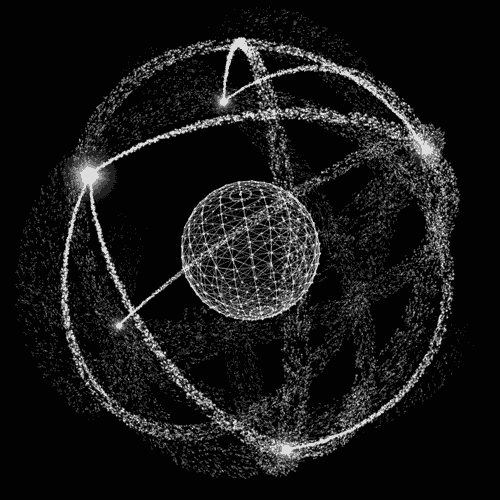

  
  <samp>
     
    Hi there! I'm <b>Emanuelle</b> 👋
      
    I'm driven to understand how systems work under the hood — and what they're truly capable of
     
    Software developer based in <b>Foz do Iguaçu</b> 🇧🇷
     
    Currently an <b>R&D scholarship holder at Itaipu Binacional</b>
  </samp>

---

#### 🚧 Currently working on
<ul>
  <li><a href="https://github.com/wowooos/surface-reconstruction-bechmark"><strong>Surface Reconstruction Benchmark</strong></a> <em>(R&D @ Itaipu)</em> — comparing 3D reconstruction algorithms and planning a visualization UI</li>
  <li><a href="https://github.com/wowooos/worker-platform"><strong>Fullstack project</strong></a> — documenting v1 and planning the next phase</li>
  <li><strong>Cybersecurity</strong> — studying secure system design and ethical hacking</li>
</ul>

#### ⚡ Interests & direction

`Low-level computing` `Hardware & Arduino` `Computer architecture` `Cybersecurity`

 

Aiming toward **Electrical/Electronic Engineering** — where software, hardware, and systems intersect.

---

#### ⚙️ Current Stack

  
  
  
  
  
  
  
     
     
  
  
  
  
  
     
     
  

    
    

   

<h4>📬 Contact</h4>
  
  
  
  

---

